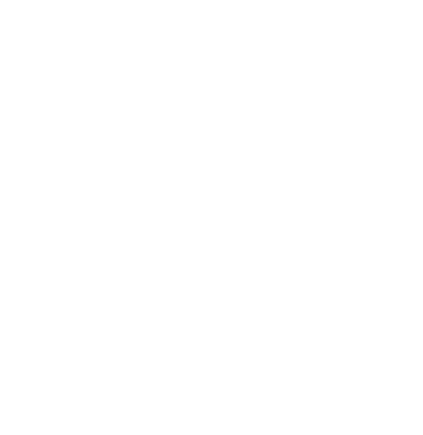

#Source code

RINGMesh is an open-source project. 
The code can be found on [GitHub](https://github.com/ringmesh/RINGMesh).
Please, create a fork to edit the code or use the GitHub [issue tracker](https://github.com/ringmesh/RINGMesh/issues) to ask any questions or report bugs.

# Packages

## Current development

[<button type="button" class="btn btn-success">
**Linux** 
</button>](download/RINGMesh-master-Linux.tar.gz)

[<button type="button" class="btn btn-success">
**MacOS (in progress)** 
</button>](download/RINGMesh-master-Darwin.tar.gz)

[<button type="button" class="btn btn-success">
**Windows (VS2013)** 
</button>](download/RINGMesh-master-Win64-vs2013.zip)

[<button type="button" class="btn btn-success">
**Windows (VS2015)** 
</button>](download/RINGMesh-master-Win64-vs2015.zip)

