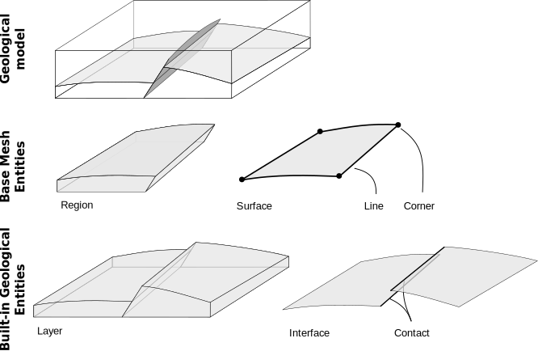

# GeoModel: Mutable object composition to represent Geological Model

The key feature of RINGMesh is the `RINGMesh::GeoModel`. It aims at representing a geological model 
with a level of complexity adapted to the problem to solve. Geological objects are complex and 
multiscale.
 
 * The first way to represent and discretize a high level of detail is to use a mesh composition 
of Entities called `RINGMesh::GeoModelEntities`. In this case, the `RINGMesh::GeoModel` defines the
boundary representation of major geological objects holding the discretization and connectivity 
between Entities.
 * The second way to deal with the geological model is to consider the global geometry through a 
single mesh. The `RINGMesh::GeoModel` have that ability to build a `RINGMesh::GeoModelMesh` on the fly.
In this object, every nodes, edges, polygons and cells can be assessed though 
a global index. It also enable a duplication of nodes along surfaces. This is useful
to feed some physical simulator and export several data structure format.

## GeoModel Constitutive Elements: GeoModelEntity

A model is defined by its constitutive elements `RINGMesh::GeoModelEntity`. 
There is two main king of entities:

 * Geometrical entities that define the geometry of the model through several dimensions:
     * Regions 
     * Surfaces
     * Lines
     * Corners
 * Geological entities that group several geometrical entities according to their geological meaning:
    * Layers 
    * Interfaces
    * Contacts

We know that this is not an complete list. A lot of entities would be valuable to complete the model. 
We strongly encourage people to contribute and complete these lists :)	

### GeoModel Geometrical Entities: GeoModelMeshEntity

A set of `RINGMesh::GeoModelMeshEntity` hold the discretization and the boundary representation of the 
geological model. Each mesh entity knows all connected higher and lower dimension mesh entities. Even if
the topology between Entities is known, each `RINGMesh::GeoModelMeshEntity` store its own mesh data 
structure independently from one to another and you can't get any global information. Geometrical 
information is contained by an abstract mesh class implemented in RINGMesh. This abstraction level is 
a strength of RINGMesh because it can be adapted to any data structure and ease the coupling between 
software ([more details about meshes](./../../features/mesh)).

 * A `RINGMesh::Region` is a volume defined by a set of `RingMesh::Surface` creating a closed "box". 
Every surfaces that bound a region can be accessed by its index. A region can be meshed with cells.
 * A `RINGMesh::Surface` is defined by a set of `RINGMesh::Line` creating a closed curve. It defines 
one border of a `RINGMesh::Region`. Neighboring lines and surfaces can be accessed by their indices.
 * A `RINGMesh::Line` is defined by two `RINGMesh::Corner`. Connected corner and surfaces can be 
accessed by their indices.
 * A `RINGMesh::Corner` is a single node that bound `RingMesh::Line`. Connected lines can be 
accessed by their indices.

### GeoModel Geological Entities: GeoModelGeologicalEntity

A `RINGMesh::GeoModelGeologicalEntity` store a geological based topological structure. It use a kind
of parent/child implementation where `RINGMesh::GeoModelGeologicalEntity` is the parent of its children
`RINGMesh::GeoModelMeshEntity`. The main idea is to cluster several geometrical entity that composed a 
geological object.

 * `RINGMesh::Layer` is composed by several RINGMesh::Region. A layer is the parent of several children 
 regions. It represents a geological layer.
 * `RINGMesh::Interface` is composed by several RINGMesh::Surface. An interface is the parent of several
 children surfaces. It represents a geological objects such as faults or horizons.
 * A `RINGMesh::Contact` (parent) is composed by several RINGMesh::Line (children). It corresponds to the
 intersections between two `RINGMesh::Interface`.
 
## GeoModel Global Representation: GeoModelMesh
 
The GeoModelMesh is one mesh built by copying and merging all `RINGMesh::GeoModelMeshEntity` of the GeoModel 
in a global and unique mesh. It allows to access to (1) a more general information than the one stores inside 
mesh of `RINGMesh::GeoModelEntity`, and (2) a single mesh representing the entire geological model.

To ease the global access to vertices, edges, facets and cells without redundancy at GeoModel geometrical
entity borders; four databases are available. These databases are empty by default and are automatically 
filled as soon as they are used.

 * The `RINGMesh::GeoModelMeshVertices` 
 * The `RINGMesh::GeoModelMeshEdges` this particular database is useful to represent wells.
 * The `RINGMesh::GeoModelMeshPolygons` 
 * The `RINGMesh::GeoModelMeshCells` gives a global access to any cell and its adjacent cells. At the mesh
interfaces cells can be either connected or disconnected. Several disconnection mode are available according
to geologic feature.
    * No Duplication
	* Duplication along faults only
	* Duplication along horizons only
	* Duplication along faults and horizons
 