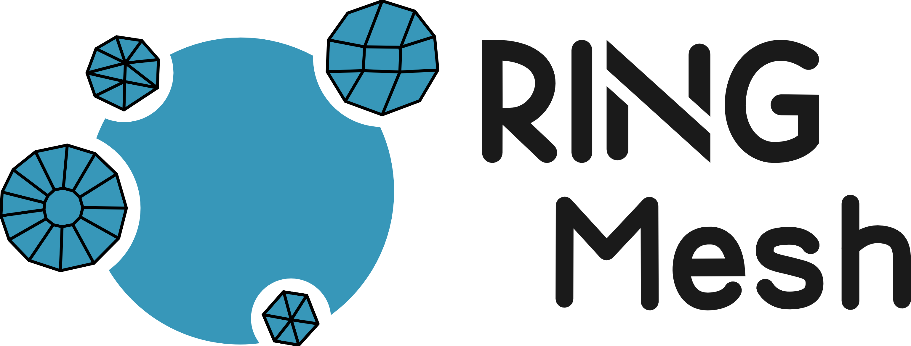
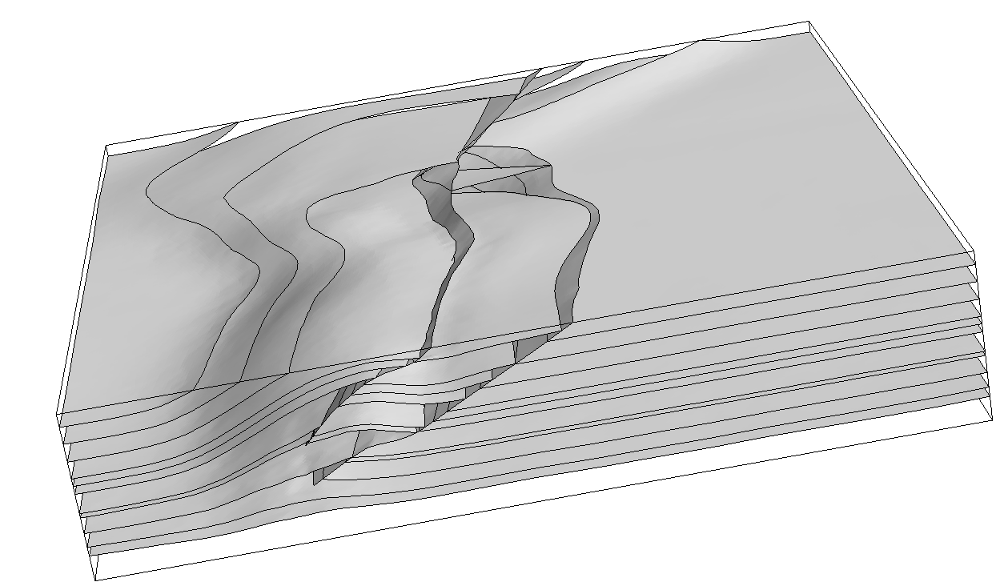

RINGMesh is a C++ open-source platform for manipulating meshes of geological models. RINGMesh is neither a geomodeler nor a mesh generation tool, but it can be used to develop geomodeling applications, such as meshing and numerical simulation tools.

## Features
* Efficient data structure to handle geological models
* Validity checks of geometric, geological and topological consistency.
* Meshes representing the geometry of geological model entities can be extented using your own data structure
* Complete and user-friendly API to use meshes in physical simulators
* Lightweight geological model viewer
* Utilities to convert geological models into another file format

More details available in the features section.
## Download
[<button type="button" class="btn btn-success">
**Latest Release**
</button>](https://github.com/ringmesh/RINGMesh/archive/5.0.0.zip)

For older releases see the [download](download.md) section.

_The SEG/EAGE Overthrust model._

## News

Date         | Message
------------ | -----------------------------------------------------------------
Nov 20, 2017 | New RINGMesh website !

## Contact

Please, use the GitHub [issue tracker](https://github.com/ringmesh/RINGMesh/issues) to ask any questions or report bugs.
See the [About](about.md) page for additional information on our team.

## They are already using it!

